# Enterprise Architecture for Business Capabilities:<sub> Driving Data, Analytics, AI & Digital Transformation at Scale</sub>

#### -  *A practitioner-oriented guide to using Business Capability Modeling as the backbone for enterprise-wide Data, AI, ML, MLOps, and Digital Transformation architectures*
---

## Executive Summary

##### Modern enterprises are no longer constrained by technology availability—they are constrained by <ins>architectural alignment</ins>.

##### Data platforms, AI/ML systems, cloud infrastructure, and digital products often fail to deliver expected business outcomes not because of poor engineering, but because strategy, capabilities, and execution are misaligned.

##### This repository presents a <ins>capability-driven Enterprise Architecture (EA) approach</ins> that:

- Anchors business strategy to execution

- Scales data, analytics, AI, and ML systems responsibly

- Enables cross-domain alignment across business, product, data, and technology

- Supports continuous evolution, not static architectures

##### The approach integrates:

- Business Capability Modeling

- TOGAF / ArchiMate / Zachman viewpoints

- Data & AI architecture patterns

- MLOps and platform operating models

- Cloud, hybrid, and on-prem deployment realities

---

## Why Business Capability Modeling Is Foundational to EA
##### What Is a Business Capability?

##### A business capability describes what an organization is able to do, independent of:

- Organizational structure

- People

- Processes

- Technologies

##### Capabilities are:

- Stable over time

- Strategy-aligned

- Ideal anchors for architectural decisions

##### Capabilities answer *“What must the enterprise be good at?”—not “How do we do it today?”*

---

## Business Capability Models as the Bridge Between Strategy & IT

##### One of the hardest EA challenges is translating strategy into executable architecture.

##### Business Capability Models (BCMs) solve this by acting as:

- A common language between business and technology

- A decision framework for investment, modernization, and divestment

- A guiding star for data, AI, and platform architectures

### Strategic Outcomes Enabled by BCMs

- Clear prioritization of AI and data initiatives

- Transparent trade-offs between speed, cost, risk, and value

- Alignment of enterprise platforms to real business outcomes

- Reduced architectural entropy and duplication

---

## Capability-Driven Enterprise Architecture (Conceptual View)

```mermaid
flowchart TD
    subgraph "🎯 Enterprise Vision"
        A[ Enterprise Strategy<br/>Corporate vision, mission,<br/>and long-term goals]
    end
    
    subgraph "📊 Business Alignment"
        B[ Strategic Objectives / OKRs<br/>Measurable goals, KPIs,<br/>and business outcomes]
    end
    
    subgraph "🔧 Business Foundation"
        C[ Business Capabilities<br/>What the business does,<br/>core competencies]
    end
    
    subgraph "💰 Value Creation"
        D[ Value Streams & Domains<br/>How value flows through<br/>the organization]
    end
    
    subgraph "🏗️ Design Blueprint"
        E[ Target State Architectures<br/>Future-state designs for<br/>business, data, applications, technology]
    end
    
    subgraph "🤖 Technology Enablement"
        F[ Data / AI / Digital Platform Capabilities<br/>ML models, data platforms,<br/>digital infrastructure]
    end
    
    subgraph "🛠️ Implementation"
        G[ Application & Technology Services<br/>APIs, microservices,<br/>technical components]
    end
    
    subgraph "🚀 Delivery"
        H[ Products, Solutions & Delivery Teams<br/>Customer-facing products,<br/>implementation teams]
    end
    
    A -- "influences<br/>sets direction for" --> B
    B -- "realized by<br/>accomplished through" --> C
    C -- "realized by<br/>operationalized through" --> D
    D -- "realized by<br/>designed through" --> E
    E -- "realized by<br/>enabled through" --> F
    F -- "served by<br/>implemented as" --> G
    G -- "used by<br/>consumed by" --> H
    
    style A fill:#dcedc8,stroke:#333,stroke-width:2px
    style B fill:#fff9c4,stroke:#333,stroke-width:2px
    style C fill:#bbdefb,stroke:#333,stroke-width:2px
    style D fill:#ffcdd2,stroke:#333,stroke-width:2px
    style E fill:#e1bee7,stroke:#333,stroke-width:2px
    style F fill:#c8e6c9,stroke:#333,stroke-width:2px
    style G fill:#ffecb3,stroke:#333,stroke-width:2px
    style H fill:#b2dfdb,stroke:#333,stroke-width:2px
```



---


---

## Mapping Capability-Driven Enterprise Architecture to TOGAF ADM

### ADM Phase Overview
- **A:** Architecture Vision
- **B:** Business Architecture
- **C:** Information Systems Architecture
- **D:** Technology Architecture
- **E:** Opportunities & Solutions
- **F:** Migration Planning
- **G:** Implementation Governance

From Archimate flowchart to Business Concept | TOGAF ADM Phase
----------------------------------------------|-----------------
Strategy & OKRs                              | Preliminary / Phase A
Capability Model                             | Phase B (Business Architecture)
Domains & Value Streams                      | Phase B
Target Architectures                         | Phases B, C, D
Platforms (Data / AI)                        | Phase C & D
Products & Delivery                          | Phases E–G


#### Capabilities bridge strategy and execution across all ADM phases.

### <ins>TOGAF ADM Framework Mapping</ins>

| Archimate/Business Concept | TOGAF ADM Phase | Description |
|----------------------------|-----------------|-------------|
| **Strategy & OKRs** | **Preliminary / Phase A** | Architecture vision, business principles, and strategic objectives |
| **Capability Model** | **Phase B (Business Architecture)** | Business capabilities, organizational structure, and processes |
| **Domains & Value Streams** | **Phase B** | Value streams, business functions, and domain decomposition |
| **Target Architectures** | **Phases B, C, D** | Business, data, application, and technology architecture definitions |
| **Platforms (Data / AI)** | **Phase C & D** | Data architecture, AI platforms, and technology infrastructure |
| **Products & Delivery** | **Phases E–G** | Implementation planning, migration, and governance |

---

### <ins>Enterprise Architecture Development Flow</ins>

| Business Concept | TOGAF Phase | Key Activities | Outputs |
|------------------|-------------|----------------|---------|
| **Strategy & OKRs** | **Preliminary / Phase A** | • Define architecture vision<br>• Establish business principles<br>• Identify stakeholders | Architecture Vision, Business Principles |
| **Capability Model** | **Phase B** (Business Architecture) | • Map business capabilities<br>• Define organizational structure<br>• Model business processes | Business Capability Map, Organization Chart |
| **Domains & Value Streams** | **Phase B** | • Identify value streams<br>• Decompose business domains<br>• Define business services | Value Stream Maps, Domain Models |
| **Target Architectures** | **Phases B, C, D** | • Design target states<br>• Define architecture building blocks<br>• Create architecture roadmap | Target Architecture, Building Blocks |
| **Platforms (Data / AI)** | **Phases C & D** | • Design data platforms<br>• Define AI/ML infrastructure<br>• Technology selection | Data Architecture, Technology Architecture |
| **Products & Delivery** | **Phases E–G** | • Implementation planning<br>• Migration strategy<br>• Architecture governance | Implementation Plan, Migration Roadmap |


### <ins>Enterprise Architecture: Archimate → TOGAF Mapping</ins>

|  Business Layer (Archimate) |  TOGAF ADM Phase |  Purpose |
|-------------------------------|--------------------|------------|
| **Strategy Elements**<br>• Goals<br>• Objectives<br>• Principles | **Phase A**<br>Architecture Vision | Establish strategic direction and business context |
| **Business Layer**<br>• Business Actors<br>• Business Processes<br>• Business Services | **Phase B**<br>Business Architecture | Define business capabilities and value streams |
| **Application Layer**<br>• Application Services<br>• Application Components | **Phase C**<br>Information Systems Architecture | Design application and data architectures |
| **Technology Layer**<br>• Infrastructure<br>• Platforms<br>• Devices | **Phase D**<br>Technology Architecture | Define technology infrastructure and standards |
| **Implementation & Migration**<br>• Work Packages<br>• Deliverables<br>• Plateaus | **Phases E–G**<br>Opportunities → Governance | Plan and govern implementation |

---

## Business Capabilities in Data, AI & ML Context

#### Example Capability Domains

#### <ins>Data & Analytics</ins>

Data Ingestion & Integration

Data Governance & Quality

Analytical Reporting & BI

Real-Time Analytics

#### <ins> AI & Machine Learning</ins>

Model Development & Training

Feature Engineering

Model Deployment & Serving

Model Monitoring & Governance

#### <ins> Digital & Platform Engineering</ins>

API & Integration Management

Cloud Platform Enablement

GPU & Accelerated Compute

Security & Compliance Automation

---

### 🔄 Capability-Driven MLOps Architecture


* Each box maps directly to business capabilities, not just tools.

---

## How to Build a Business Capability Model (Practitioner View)

#### <ins>Step 1: Assess Strategic Needs</ins>

Engage executives, business leaders, architects

Analyze market, competition, and regulatory context

Identify differentiating capabilities

#### <ins>Step 2: Define Required Capabilities</ins>

Rank capabilities by strategic importance

Organize into a hierarchical capability map

Avoid org charts or system bias

#### <ins>Step 3: Assess Current Capabilities</ins>

Perform gap and maturity analysis

Identify capability debt and risks

Highlight AI-ready vs AI-constrained domains

#### <ins> Step 4: Link Capabilities to Architecture</ins>

- Map capabilities to:

  - [x]  Applications
      
  - [x]  Data products
        
  -  [x]     AI/ML platforms

  - [x]  Infrastructure & security controls
 
---

## Example: Capability Maturity vs Business Impact

### Inforgraphs such as such shown below helps executives prioritize investments objectively.

> [!NOTE]
> For interested readers, the codes for the graph below exist in the repository*
>


---

## People as First-Class Architectural Elements

##### Modern EA treats **people**, **ownership**, and **accountability** as architectural assets.

##### Connecting people to capabilities enables:

- Identification of domain experts

- Detection of single points of failure

- Improved governance and decision velocity

---

## From Static Models to Living Architecture

#### Effective EA is not documentation—it is decision enablement.

##### Best practices:

- Treat capability models as living artifacts

- Continuously update maturity and health signals

- Integrate with portfolio, funding, and delivery systems

- Broadcast insights across the organization

---

## Outcomes of Capability-Driven EA for AI & Digital Transformation

### Measurable Business Benefits

| Capability-Driven Outcome | Enterprise Benefit | Key Metrics | Impact Level | Business Impact |
|---------------------------|-------------------|-------------|-------------|-----------------|
| **Reduced Duplication** | Lower cost, faster delivery | • 40% reduction in redundant systems<br>• 60% faster project delivery<br>• 30% lower TCO | **Operational** | Direct operational efficiency gains |
| **Clear AI Governance** | Trustworthy, compliant AI | • 100% audit compliance<br>• 90% reduction in AI bias incidents<br>• 95% model transparency | **Compliance** | Regulatory compliance & ethical AI |
| **Faster Decision-Making** | Reduced time-to-value | • 75% faster architecture decisions<br>• 50% reduction in approval cycles<br>• 3x faster POC-to-production |**Strategic** | Accelerated innovation velocity |
| **Scalable Platforms** | Sustainable innovation | • 5x scalability with same resources<br>• 80% platform reuse<br>• Zero vendor lock-in | **Growth** | Long-term growth foundation |
| **Executive Alignment** | Predictable outcomes | • 100% project-business goal alignment<br>• 90% stakeholder satisfaction<br>• 95% on-time, on-budget delivery | **Governance** | Strategic execution certainty |

### How Capability-Driven EA Enables Transformation
1. **Common Language:** Business and IT speak the same capability language
2. **Strategic Alignment:** All initiatives trace back to business capabilities
3. **Investment Focus:** Resources allocated to capability gaps
4. **Agile Response:** Capability models enable rapid adaptation
5. **Value Realization:** Clear line from investment to business outcome


### Transformation Outcomes Matrix

| Business Challenge | Capability-Driven Solution | Enterprise Outcome |
|--------------------|----------------------------|-------------------|
| **Costly Duplication**<br>Multiple teams building similar solutions | **Shared Capability Models**<br>Reusable patterns and platforms | ✅ **40% cost reduction**<br>✅ **60% faster delivery** |
| **AI Governance Gaps**<br>Uncontrolled AI model proliferation | **AI Capability Framework**<br>Governed AI/ML lifecycle management | ✅ **100% compliance**<br>✅ **Trustworthy AI systems** |
| **Slow Decision Cycles**<br>Lengthy architecture review processes | **Capability-Based Prioritization**<br>Fast-track decisions aligned to capabilities | ✅ **75% faster decisions**<br>✅ **Reduced time-to-value** |
| **Limited Scalability**<br>Platforms can't handle growth | **Scalable Capability Platforms**<br>Cloud-native, elastic architectures | ✅ **5x scalability**<br>✅ **Sustainable innovation** |
| **Executive Misalignment**<br>IT projects disconnected from business goals | **Capability Roadmaps**<br>Executive dashboards with capability metrics | ✅ **Predictable outcomes**<br>✅ **Strategic alignment** |

### Key Performance Indicators (KPIs)
- **Cost Efficiency:** 30-40% reduction in IT spending
- **Speed to Market:** 50-60% faster project delivery
- **AI Governance:** 90%+ compliance audit success
- **Scalability:** 5x increase without proportional cost increase
- **Alignment:** 95%+ executive satisfaction with IT outcomes

---

## Final Perspective

> Enterprise Architecture succeeds when it stops being about diagrams and starts being about outcomes.

#### Business Capability Modeling provides the stable, strategy-aligned backbone that allows enterprises to:

- Scale AI responsibly

- Modernize data platforms confidently

- Govern complexity without slowing innovation

- Translate ambition into execution


---


### Thank you for reading
---

### **AUTHOR'S BACKGROUND**
### Author's Name:  Emmanuel Oyekanlu
```
Skillset:   I have experience spanning several years in data science, developing scalable enterprise data pipelines,
enterprise solution architecture, architecting enterprise systems data and AI applications,
software and AI solution design and deployments, data engineering, high performance computing (GPU, CUDA), machine learning,
NLP, Agentic-AI and LLM applications as well as deploying scalable solutions (apps) on-prem and in the cloud.

I can be reached through: manuelbomi@yahoo.com

Website:  http://emmanueloyekanlu.com/
Publications:  https://scholar.google.com/citations?user=S-jTMfkAAAAJ&hl=en
LinkedIn:  https://www.linkedin.com/in/emmanuel-oyekanlu-6ba98616
Github:  https://github.com/manuelbomi

```
[](https://skillicons.dev)


